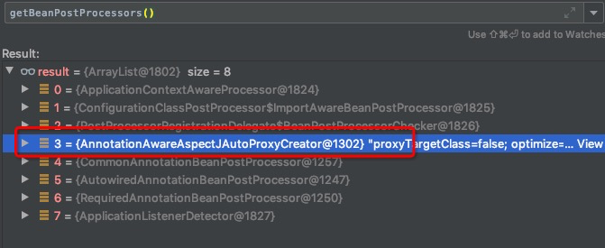

# Spring AOP

原文：https://cloud.tencent.com/developer/article/1687361

## 一. AOP 示例

Spring AOP 的存在，帮助少写很多的业务无关而又冗余的代码。下面整个演示例子。

1. 示例中，申明一个用户业务逻辑相关的接口，在接口中定义了一个登陆的方法：

   ```java
   public interface UserSerivce {
       void login() throws InterruptedException;
   }
   ```

   

2. 申明一个实现类，并实现了 UserService 接口，并给该实现类加上，由Spring 加载时初始化：

   ```java
   @Service 
   public class UserServiceImpl implements UserService {
       @Override
       public void login() throws InterruptedException {
           System.out.println("用户登陆执行开始");
           Thread.sleep(1000);
           System.out.println("用户登陆执行结束");
       }
   }
   ```

   

3. 开始定义AOP切面

   * 先配置一个切入点，切入点主要的是表达式
   * 在配置AOP中的通知，表示进入切面时，需要做的通用代码的处理
   * 给 AOP 类加上 @Aspect 注解，指定该类是AOP类

   代码如下：

   ```java
   @Aspect
   @Component
   public class AppServcie {
       @Pointcut("execution(* com.ywl.leetcode.spring.ready..*.*(..))")
       public void runApp(){
           
       }
       
       @Around("runAop()")
       public void around(ProceedingJoinPoint pjp) throws Throwalbe {
           System.out.println("环绕通知前");
           long startTime = System.currentTimeMillis();
           Object proceed = pjp.proceed();
           System.out.println("方法执行时间：" + 
                 (System.currentTimeMillis() - startTime) + "毫秒");
           System.out.println("环绕通知后");
       }
       
   }
   ```

   

4. 开启AOP 执行开关

   ```java
   @ComponentScan("com.ywl.leetcode")
   @EnableAspectJAutoProxy
   public class AppConfig {
   }
   ```

   

5. 运行代码

   ```java
   public static void main(String[] args) throws InterruptedException {
       AnnotationConfigApplicationContext context = 
           new AnnotationConfigApplicationContext(AppConfig.class);
       UserService userService = context.getBean(UserService.class);
       userService.login();
   }
   ```

   运行结果：

   ```shell
   环绕通知前
   用户登陆执行开始
   用户登陆执行结束
   方法执行时间：2002毫秒
   环绕通知后
   ```

   计算登陆时间的代码在 AOP 中成功执行了。

6. 观察有AOP和无AOP 的情况下，UserService 的示例

   * 无 AOP，UserService 为正常的 java 类

     

   * 有 AOP，UserService 变成了 JDK 动态代理对象

     

## 二. 源码阅读

对 UserService 的 bean 的初始化过程进行debug发现，在 doCreateBean 中变成了代理对象：


### 2.1 doCreateBean

1. createBeanInstance 中，调用后置处理器，推断合适的构造函数，并通过反射 new 出了 UserService 的早期对象

2. applyMergedBeanDefinitionPostProcessors 中，调用后置处理器，目的是合并注解，根据策略使用对应的后置处理器

   @Resource 、 @PostConstruct 注解使用了CommonAnnotationBeanPostProcessor 处理器。

   @Autowired、@Value 注解使用了 AutowiredAnnotationBeanPostProcessor处理器

3. addSingletonFactory 中，暴露了 bean 早期引用，并放入到二级缓存中，以解决Bean的循环依赖

4. populateBean中，根据后置处理器进行属性依赖注入

5. initialzeBean 执行完毕，发现UserService 变为了代理对象

### 2.2 InitializeBean

1. invoekAwareMethods，执行对应方法，set依赖的属性

   ```java
   private void invokeAwareMethods(final String beanName, final Object bean) {
      if (bean instanceof Aware) {
         if (bean instanceof BeanNameAware) {
            ((BeanNameAware) bean).setBeanName(beanName);
         }
         if (bean instanceof BeanClassLoaderAware) {
            ((BeanClassLoaderAware) bean).setBeanClassLoader(getBeanClassLoader());
         }
         if (bean instanceof BeanFactoryAware) {
            ((BeanFactoryAware) bean).setBeanFactory(AbstractAutowireCapableBeanFactory.this);
         }
      }
   }
   ```

   

2. applyBeanPostProcessorsBeforeInitialization, 真正调用后置处理器的 postProcessBeforeInitialization 方法

3. invokeInitMethods， 执行bean的初始化方法

   从这块源码的执行顺序其实可以看出初始化方法的一些执行顺序为：

   postProcessBeforeInitialization -> afterPropertiesSet ->initMethod

4. applyBeanPostProcessorsAfterInitialization，真正调用后置处理的postProcessAfterInitalization，并且userService变为了代理对象

### 2.3beanPostProcessors



只有第三个和动态代理有关系。

org.springframework.aop.framework.autoproxy.AbstractAutoProxyCreator#postProcessAfterInitialization—>createProxy，进行代理工厂的组装。

```java
protected Object createProxy(
      Class<?> beanClass, String beanName, Object[] specificInterceptors, TargetSource targetSource) {
   //...
   ProxyFactory proxyFactory = new ProxyFactory();
   proxyFactory.copyFrom(this);
   if (!proxyFactory.isProxyTargetClass()) {
      if (shouldProxyTargetClass(beanClass, beanName)) {
         proxyFactory.setProxyTargetClass(true);
      }
      else {
         evaluateProxyInterfaces(beanClass, proxyFactory);
      }
   }

   Advisor[] advisors = buildAdvisors(beanName, specificInterceptors);
   proxyFactory.addAdvisors(advisors);
   proxyFactory.setTargetSource(targetSource);
   customizeProxyFactory(proxyFactory);
   proxyFactory.setFrozen(this.freezeProxy);
   if (advisorsPreFiltered()) {
      proxyFactory.setPreFiltered(true);
   }
   //代理方法执行的核心方法
   return proxyFactory.getProxy(getProxyClassLoader());
}
```

## 三. 代理方法执行的核心方法

```java
public Object getProxy(ClassLoader classLoader) {
   return createAopProxy().getProxy(classLoader);
}
```

### 3.1 createAopProxy

```java
@Override
public AopProxy createAopProxy(AdvisedSupport config) throws AopConfigException {
   if (config.isOptimize() || config.isProxyTargetClass() || hasNoUserSuppliedProxyInterfaces(config)) {
      Class<?> targetClass = config.getTargetClass();
      if (targetClass == null) {
         throw new AopConfigException("TargetSource cannot determine target class: " +
               "Either an interface or a target is required for proxy creation.");
      }
      if (targetClass.isInterface() || Proxy.isProxyClass(targetClass)) {
         return new JdkDynamicAopProxy(config);
      }
      return new ObjenesisCglibAopProxy(config);
   }
   else {
      return new JdkDynamicAopProxy(config);
   }
}
```

上图所示的代码其实就是spring aop中选择动态代理的核心方法。**主要思想其实为，如果代理类为接口，就使用JDK动态代理。如果不为接口，就使用CGLIB动态代理**。

上图中的config.isOptimize和conifg.isProxyTargetClass，如果当你没有进行配置的话，就读取的是spring的默认配置，具体的配置信息：

```java
public @interface EnableAspectJAutoProxy {

   /**
    * Indicate whether subclass-based (CGLIB) proxies are to be created as opposed
    * to standard Java interface-based proxies. The default is {@code false}.
    */
   boolean proxyTargetClass() default false;
   /**
    * Indicate that the proxy should be exposed by the AOP framework as a {@code ThreadLocal}
    * for retrieval via the {@link org.springframework.aop.framework.AopContext} class.
    * Off by default, i.e. no guarantees that {@code AopContext} access will work.
    * @since 4.3.1
    */
   boolean exposeProxy() default false;
}
```

根据spring中的注释可以得出，默认采用的是JDK动态代理。

### 3.2 使代理类变成 CGLIB 动态代理类

只需要将UserServiceImpl的接口去掉即可，修改后代码如下：

```java
@Service("userServiceImpl")
public class UserServiceImpl {
    public void login() throws InterruptedException {
        System.out.println("用户登录执行开始");
        Thread.sleep(2000);
        System.out.println("用户登录执行结束");
    }
}
```

至于cglib和jdk动态代理的具体执行过程，放到下一篇动态代理中，单独来进行分析。

## 四. AOP通知

aop中的通知（即代理加强方法）加上上述示例中的环绕通知，共有五种通知。

·  @Before：前置通知，在方法执行之前执行。

·  @After：后置通知，在方法执行之后执行。

·  @AfterRunning：返回通知，在方法返回结果之后执行。

·  @AfterThrowing：异常通知，在方法执行出现异常之后执行。

·  @Around：环绕通知，方法执行前与执行后执行。
