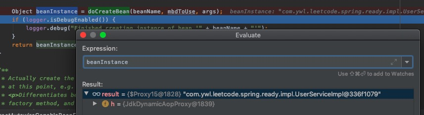

# Spring AOP

原文：https://cloud.tencent.com/developer/article/1687361

## 一. AOP 示例

Spring AOP 的存在，帮助少写很多的业务无关而又冗余的代码。下面整个演示例子。

1. 示例中，申明一个用户业务逻辑相关的接口，在接口中定义了一个登陆的方法：

   ```java
   public interface UserSerivce {
       void login() throws InterruptedException;
   }
   ```

   

2. 申明一个实现类，并实现了 UserService 接口，并给该实现类加上，由Spring 加载时初始化：

   ```java
   @Service 
   public class UserServiceImpl implements UserService {
       @Override
       public void login() throws InterruptedException {
           System.out.println("用户登陆执行开始");
           Thread.sleep(1000);
           System.out.println("用户登陆执行结束");
       }
   }
   ```

   

3. 开始定义AOP切面

   * 先配置一个切入点，切入点主要的是表达式
   * 在配置AOP中的通知，表示进入切面时，需要做的通用代码的处理
   * 给 AOP 类加上 @Aspect 注解，指定该类是AOP类

   代码如下：

   ```java
   @Aspect
   @Component
   public class AppServcie {
       @Pointcut("execution(* com.ywl.leetcode.spring.ready..*.*(..))")
       public void runApp(){
           
       }
       
       @Around("runAop()")
       public void around(ProceedingJoinPoint pjp) throws Throwalbe {
           System.out.println("环绕通知前");
           long startTime = System.currentTimeMillis();
           Object proceed = pjp.proceed();
           System.out.println("方法执行时间：" + 
                 (System.currentTimeMillis() - startTime) + "毫秒");
           System.out.println("环绕通知后");
       }
       
   }
   ```

   

4. 开启AOP 执行开关

   ```java
   @ComponentScan("com.ywl.leetcode")
   @EnableAspectJAutoProxy
   public class AppConfig {
   }
   ```

   

5. 运行代码

   ```java
   public static void main(String[] args) throws InterruptedException {
       AnnotationConfigApplicationContext context = 
           new AnnotationConfigApplicationContext(AppConfig.class);
       UserService userService = context.getBean(UserService.class);
       userService.login();
   }
   ```

   运行结果：

   ```shell
   环绕通知前
   用户登陆执行开始
   用户登陆执行结束
   方法执行时间：2002毫秒
   环绕通知后
   ```

   计算登陆时间的代码在 AOP 中成功执行了。

6. 观察有AOP和无AOP 的情况下，UserService 的示例

   * 无 AOP，UserService 为正常的 java 类

     

   * 有 AOP，UserService 变成了 JDK 动态代理对象

     

## 二. 源码阅读

对 UserService 的 bean 的初始化过程进行debug发现，在 doCreateBean 中变成了代理对象：



### 2.1 doCreateBean

1. createBeanInstance 中，调用后置处理器，推断合适的构造函数，并通过反射 new 出了 UserService 的早期对象

2. applyMergedBeanDefinitionPostProcessors 中，调用后置处理器，目的是合并注解，根据策略使用对应的后置处理器

   @Resource 、 @PostConstruct 注解使用了CommonAnnotationBeanPostProcessor 处理器。

   @Autowired、@Value 注解使用了 AutowiredAnnotationBeanPostProcessor处理器

3. addSingletonFactory 中，暴露了 bean 早期引用，并放入到二级缓存中，以解决Bean的循环依赖

4. populateBean中，根据后置处理器进行属性依赖注入

5. initialzeBean 执行完毕，发现UserService 变为了代理对象

### 2.2 InitializeBean

1. invoekAwareMethods，执行对应方法，set依赖的属性

   ```java
   private void invokeAwareMethods(final String beanName, final Object bean) {
      if (bean instanceof Aware) {
         if (bean instanceof BeanNameAware) {
            ((BeanNameAware) bean).setBeanName(beanName);
         }
         if (bean instanceof BeanClassLoaderAware) {
            ((BeanClassLoaderAware) bean).setBeanClassLoader(getBeanClassLoader());
         }
         if (bean instanceof BeanFactoryAware) {
            ((BeanFactoryAware) bean).setBeanFactory(AbstractAutowireCapableBeanFactory.this);
         }
      }
   }
   ```

   

2. applyBeanPostProcessorsBeforeInitialization, 真正调用后置处理器的 postProcessBeforeInitialization 方法

3. invokeInitMethods， 执行bean的初始化方法

   从这块源码的执行顺序其实可以看出初始化方法的一些执行顺序为：

   postProcessBeforeInitialization -> afterPropertiesSet ->initMethod

