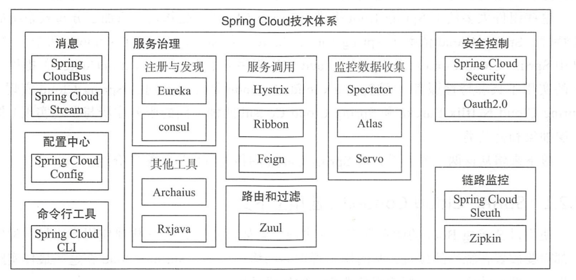

# SpringCloud概览

https://www.toutiao.com/a6859937610693870091/

Spring Cloud大家常挂在嘴边，那么什么是Spring Cloud呢？

Spring Cloud 作为 Java 言的微服务框架，它依赖于 Spring Boot ，有快速开发、持续交付和容易部署等特点。 Spring Cloud 的组件非常多，涉及微服务的方方面面，井在开源社区 Spring、Netflix Pivotal 两大公司的推动下越来越完善。

SpringCloud是一系列组件的有机集合。

图1. Spring Cloud体系结构