# SpringCloud概览

https://www.toutiao.com/a6859937610693870091/

Spring Cloud大家常挂在嘴边，那么什么是Spring Cloud呢？

Spring Cloud 作为 Java 言的微服务框架，它依赖于 Spring Boot ，有快速开发、持续交付和容易部署等特点。 Spring Cloud 的组件非常多，涉及微服务的方方面面，井在开源社区 Spring、Netflix Pivotal 两大公司的推动下越来越完善。

SpringCloud是一系列组件的有机集合。

​                                                                   图1. Spring Cloud体系结构

Spring Cloud的思维导图：

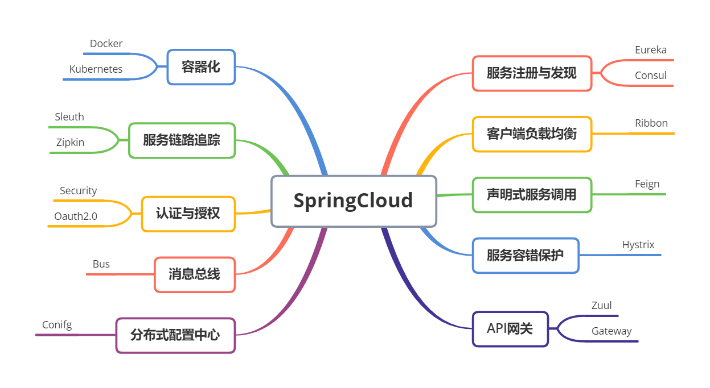

​                                                                   图2 Spring Cloud学习思维导图

## Spring Cloud主要组件

接下来简单介绍Spring Cloud的各个组件

### Eureka

Netflix Eureka是由Netflix开源的一款基于REST的服务发现组件，包括Eureka Server及Eureka Client。

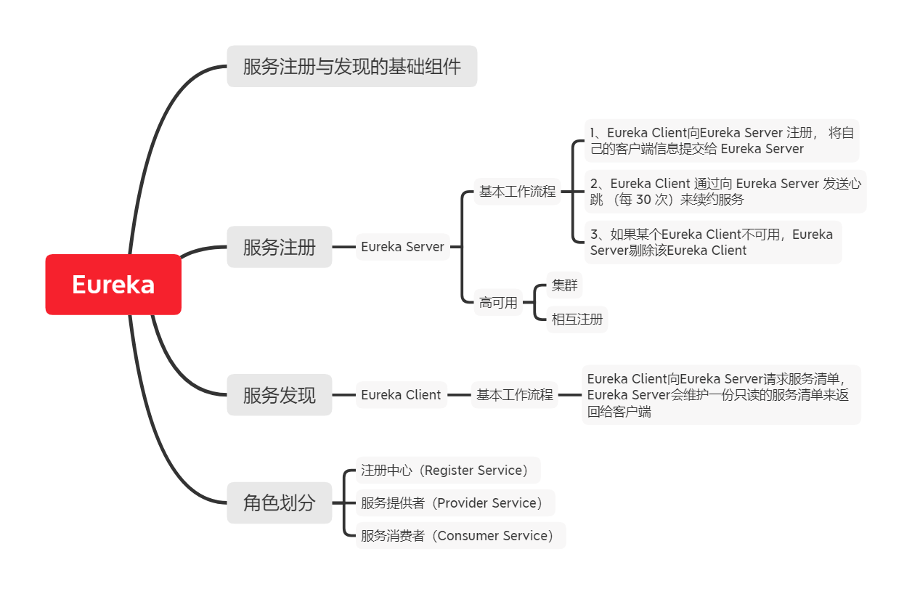

​                                                                   图3 Eureka组件

### Ribbon

Ribbon是Netflix公司开源的一个负载均衡组件。

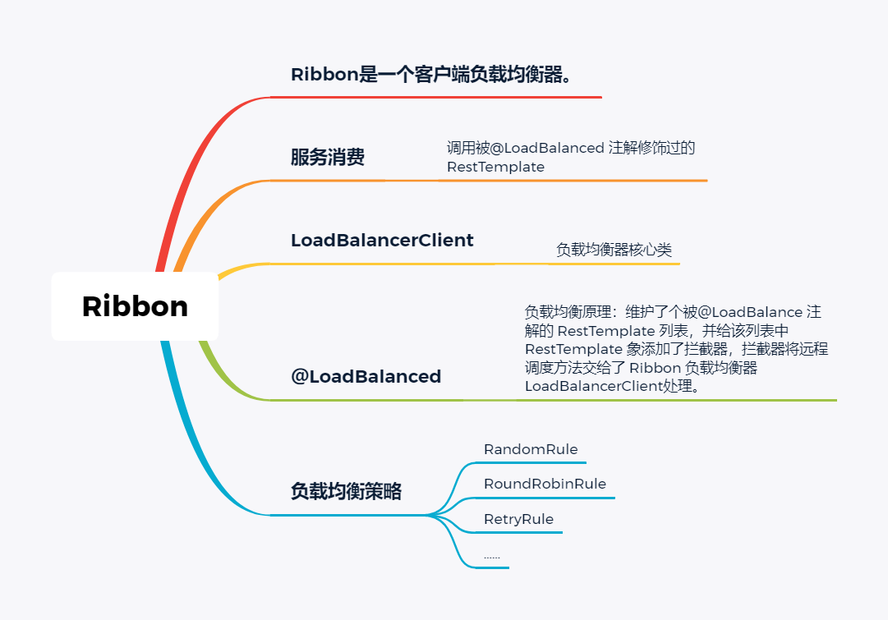

​                                                                   图4 Ribbon组件

### Feign

Feign是一个声明式的Web Service客户端

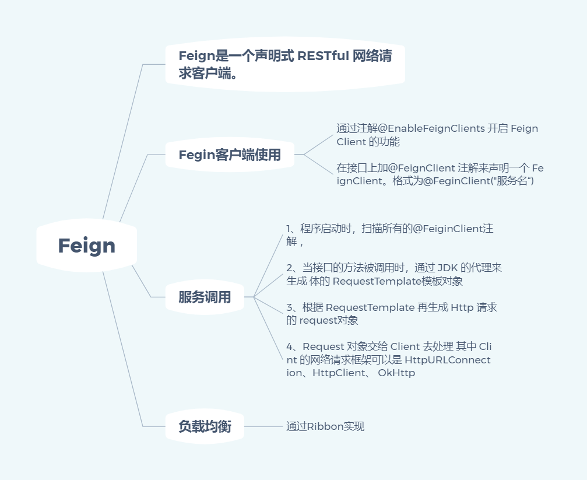

​                                                                   图5 Feign组件

### Hystrix

Hystrix是netflix公司开源的一个项目，它提供了熔断器功能，能够阻止分布式系统中出现联动故障。

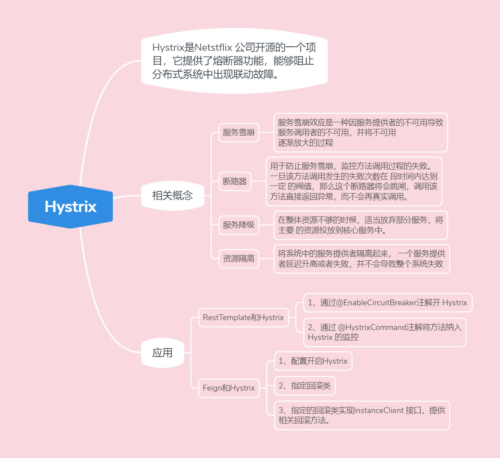

​                                                                   图6 Hystrix

### Zuul

Zuul是由Netflix孵化的一个致力于“网关”解决方案的开源组件。

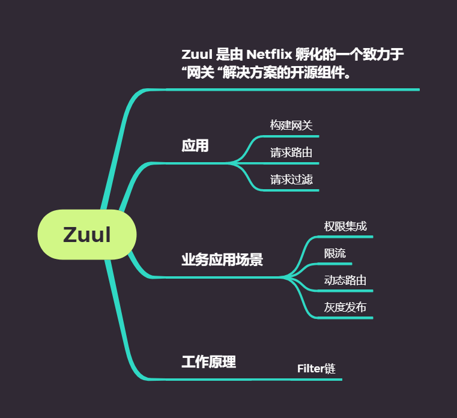

​                                                                   图7 Zuul

### Gateway

SpringCloud Gateway是Spring官方基于Spring5.0， Spring Boot 2.0和Project Reactor等技术开发的网关。Spring Cloud Gateway旨在为微服务架构提供简单、有效且统一的API路由管理方式。

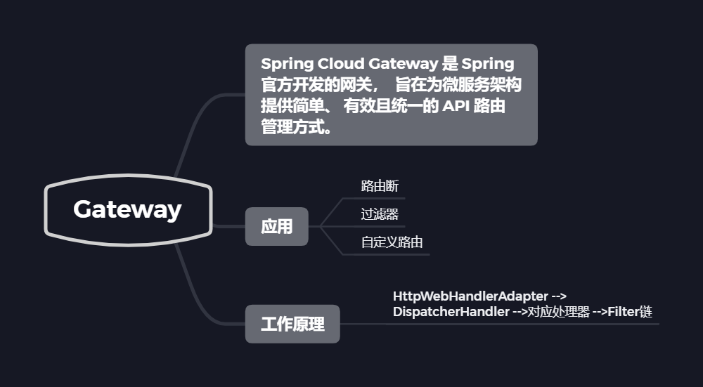

​                                                                   图8 Spring Cloud Gateway

### Config

Spring Cloud提供了分布式配置中心Spring Cloud Config，为外部配置提供了客户端和服务器端的支持。

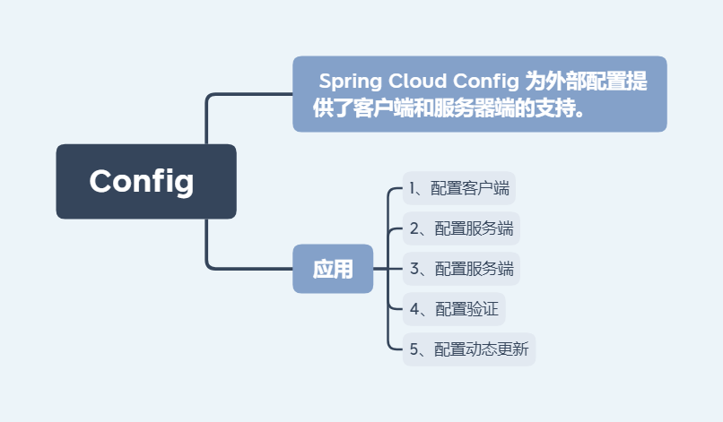

​                                                                   图9 Spring Cloud Config

### Bus

使用Spring Cloud Bus，可以非常容易的搭建起消息总线。

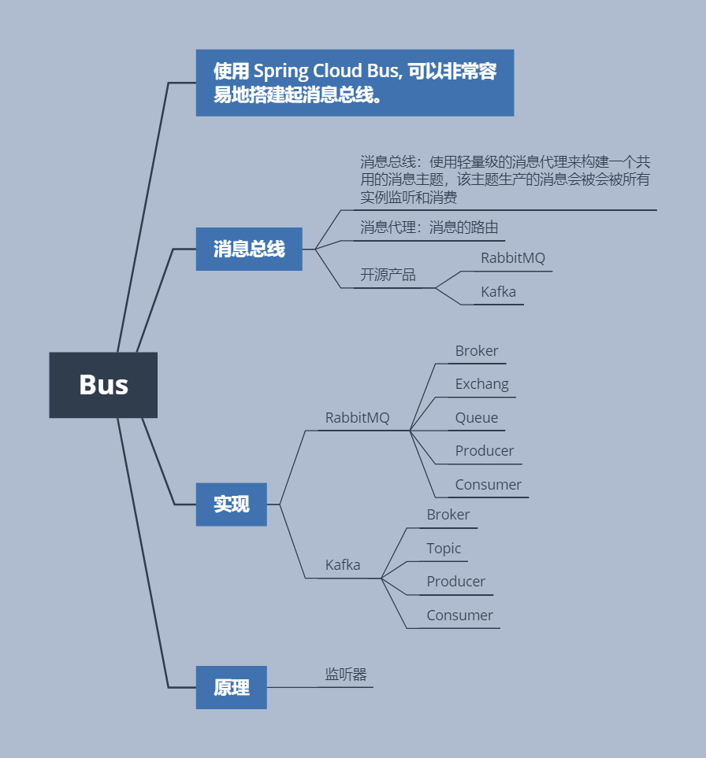

​                                                                   图10 Spring Cloud Bus

### OAuth2

Spring Cloud构建的微服务系统中可以使用Spring Cloud OAuth2来保护微服务系统

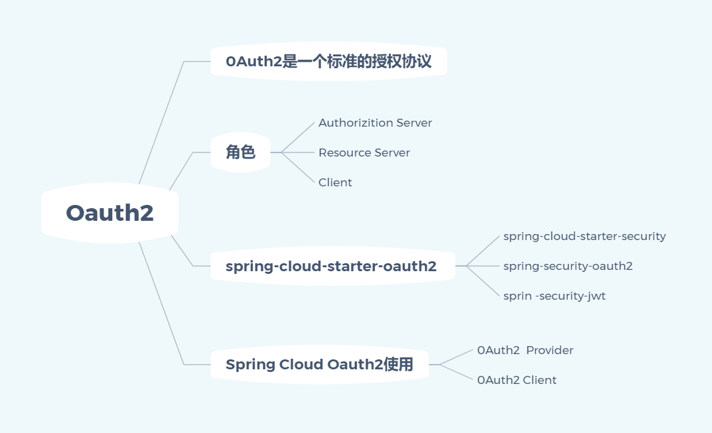

​                                                                   图11 Spring Cloud OAuth2

### Sleuth

Spring Cloud Sleuth是Spring Cloud的组件，它的主要功能是分布式系统中提供服务链路追踪的解决方案。

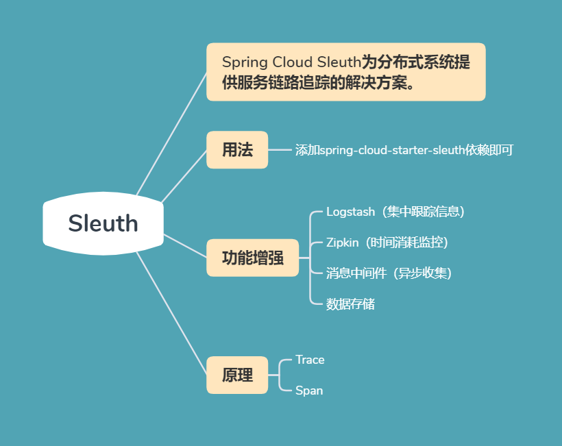

​                                                                   图12 Spring Cloud Sleuth

## 总结

本文中对架构的演进及Spring Cloud 构建微服务的基本组件进行了概览。

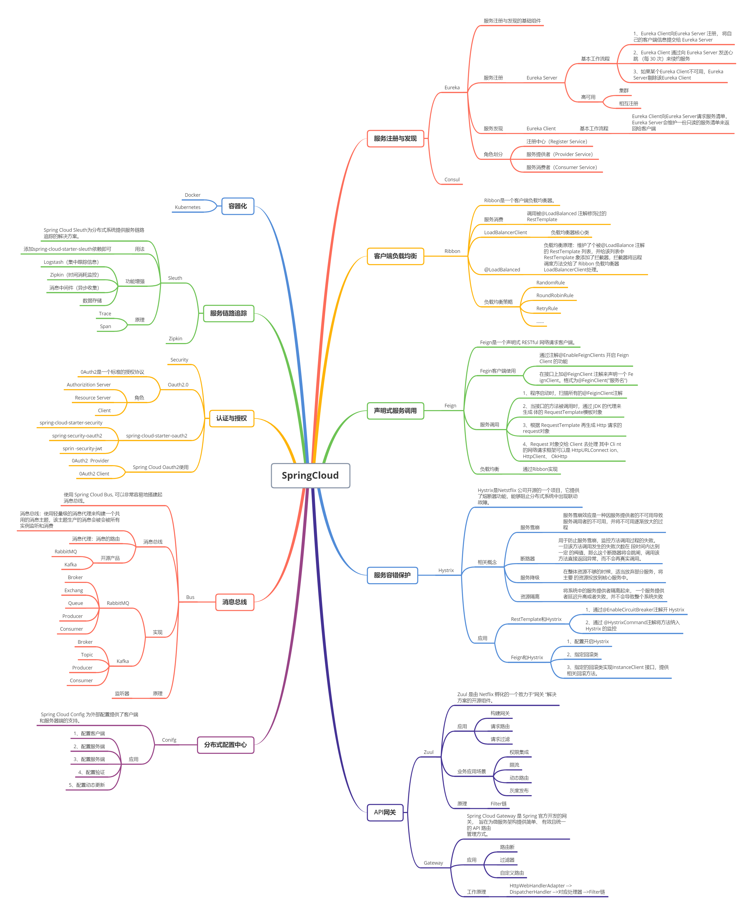

​                                                                   图13 总结