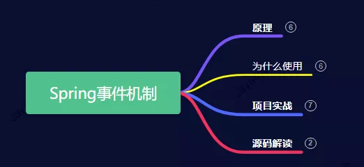
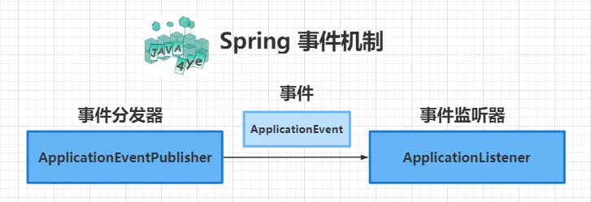
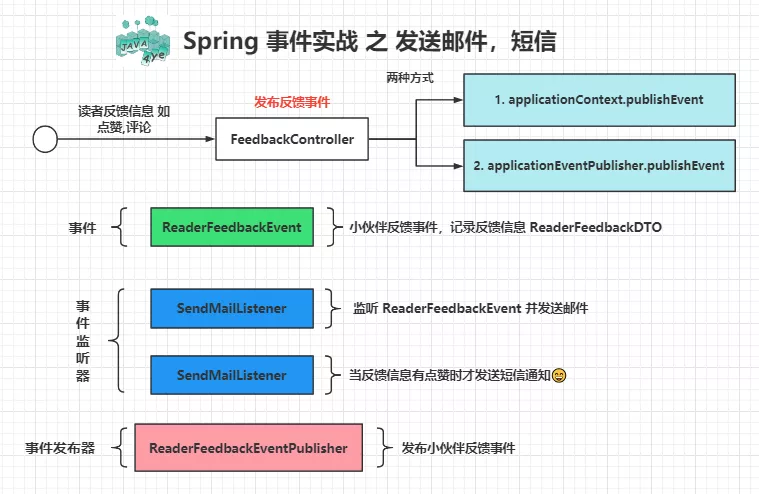
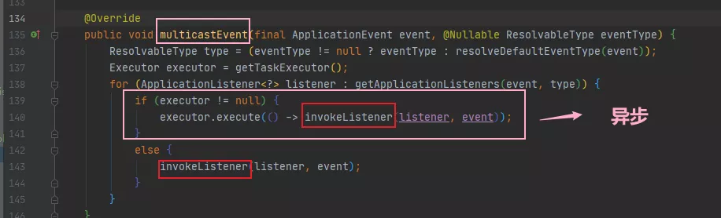
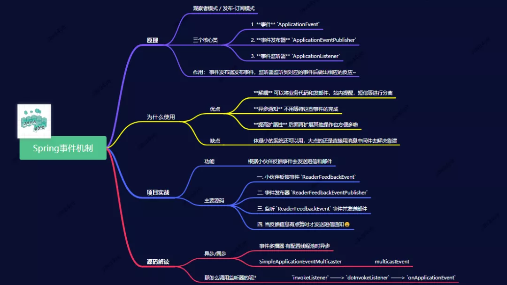

# Spring 事件机制

原文：https://mp.weixin.qq.com/s/XjGIK11FeNpJWUTZhJhqlg


## 一. 内容概览



## 二. 原理



Spring 的 Event 机制就是一个 ***发布-订阅*** 模式。

有 三个核心类：

1. 事件：***ApplicationEvent***
2. 事件发布器：***ApplicationEventPublisher***
3. 事件监听器：***ApplicationListener***

事件发布器发布事件，监听器监听到对应的事件后，做出相应的反应。

## 三. 使用

### 3.1 场景

> *领导：想在用户操作完后发个邮件通知下A*
>
> *我：好的*
>
> *几天后……*
>
> *领导：算了，先站内提醒就好了，后面再考虑发短信通知啥的，看看哪个效果好点*
>
> *我：……好的*
>
> *一开始我也没用这个事件机制的，没多想就写一起了*
>
> *后面觉得有点不对劲，才想起来用这招的*

### 3.2 优点

* **解耦**：可以将业务代码和发邮件、站内提醒、短信等进行分离
* **异步通知**：不用等待这些事件的完成
* **提高扩展性**：后续扩展其他操作更方便

### 3.3 提醒

体量小的系统可以使用，大系统需要直接用消息中间件来解决。都是消息驱动思想。

## 四. 项目实战



### 4.1 功能

根据反馈事件去发送短信和邮件

### 4.2 主要源码

#### 4.2.1 反馈事件 *ReaderFeedbackEvent*

```java
@Getter
public class ReaderFeedbackEvent extends ApplicationEvent {
    privat ReaderFeadbackDTO feedbackDTO;
    
    public ReaderFeedBackEvent(Object source, ReaderFeedbackDTO feadbackDTO) {
        super(source);
        this.feedbackDTO = feedbackDTO;
    }
}
```

说明：

* 业务的事件，需要继承 Spring的 ***ApplicationEvent***
* Object source：事件发起方对象实例 - 本人补充

#### 4.2.2 事件发布器 ReaderFeedbackEventPublisher

```java
@Component
@Slf4j
public class ReaderFeedbackEventPublisher implements ApplicationEventPublisherAware {
    private ApplicationEventPublisher applicationEventPublisher;
    
    @Override
    public void setApplicationEventPublisher(ApplicationEventPublisher applicationEventPublisher) {
        this.applicationEventPublisher = applicationEventPublisher;
    }
    
    public void publisherFeedbackEvent(ReaderFeedbackDTO feedbackDTO) {
        log.info("publish feedback event start");
        applicationEventPublisher.publisherEvent(new ReaderFeedbackEvent(this, feedbackDTO));
        log.info("publish feedback event end");
    }
}
```

说明：

* 实现 ***ApplicationEventPublisherAware*** 接口，获取 ***ApplicationEventPulisher*** 事件发布器去发布事件

#### 4.2.3 监听 ReaderFeedbackEvent 事件并发送邮件

```java
@Slf4j
@Component
@Order(1)
public class SendMailListener implements ApplicationListener<ReaderFeedbackEvent> {
	@Value("{spring.mail.username}")
    private String from;
    
    @Autowared
    private JavaMailSender jms;
    
    @Override
    public void onApplicationEvent(ReaderFeedbackEvent readerFeedbackEvent) {
        ReaderFeedbackDTO feedbackDTO = readerFeedbackEvent.getFeedbackDTO();
        sendMail(feedbackDTO.toString());
    }
    
    private void sendMail(String context) {
        try {
            SimpleMailMessage msg = new SimpleMailMessage();
            msg.setFrom(from);
            msg.setTo("abc@outlook.com");
            msg.setSubject("test");
            msg.setText(context);
            jms.send(msg);
        }catch(Exception e) {
            log.error("");
        }
    }
}
```

说明：

* 实现 ***ApplicationListener*** 这个接口，获取事件中的反馈信息，并发送邮件（*onApplicationEvent方法*）

#### 4.2.4 当反馈信息有点赞时才发送短信通知

```java
@Slf4j
@Component
@Order(2)
public class SendSmsListener {
    
    @EventListener(condition = "#feedbackEvent.feedbackDTO.like==true")
    public void sendSms(ReaderFeedbackEvent feedbackEvent) {
        SmsUtil.sendSms("Tester","***","***","sms_context","utf8");        
    }
}
```

说明：

* 监听器的第二种写法 -- 注释，比较方便，这里监听并判断是不是点赞来决定是否发送

### 4.3 小结

通过例子可以看出，事件模型在 Spring 框架下已经很简单了。下面是上述例子的整体流程：


## 五. Spring源码解读

​        

这个方法在 **事件多播器** ( *SimpleApplicationEventMulticaster* ) 中，可以看到当有配置这个**线程池**时，是走**异步**通知路线的。

### 5.1 怎么调用监听器

只有简单的 3 步，最后回到 ***onApplicationEvent*** 方法中去处理：

> ***invokeListener -> doInvokeListener -> onApplicationEvent***

```java
private void doInvokeListener(ApplicationListener listener, ApplicationEvent event) {
    try {
        listener.onApplicationEvent(event);
    } catch(ClassCastException e) {}
}
```

## 六. 思维导体

