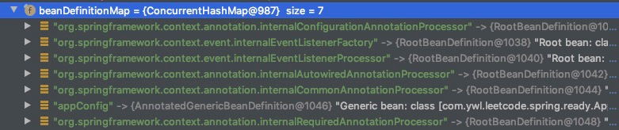
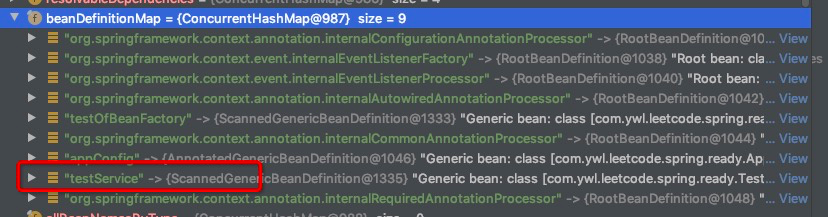
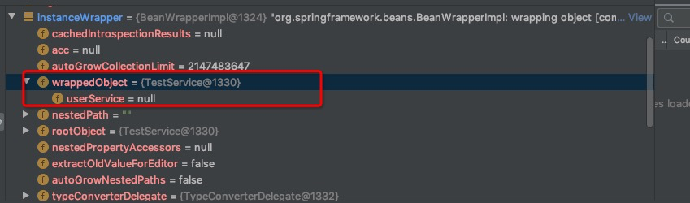
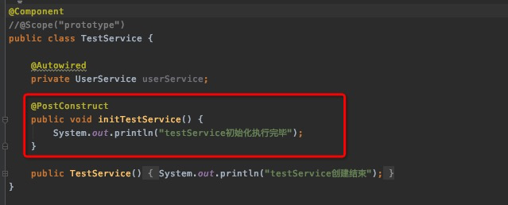
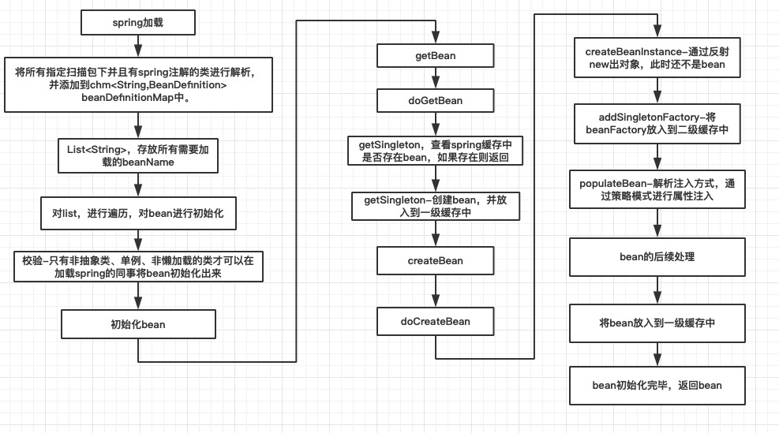

# Spring Bean 的初始化过程

原文：https://cloud.tencent.com/developer/article/1687358

## 一. Spring Bean注入示例

用注解的方式来演示Bean的注入过程。

1. 通过 @ComponentScan 扫描 com.ywl.leetcode 包下的所有类：

   ```java
   @ComponentScan("com.ywl.leetcode")
   public class AppCofig {
   }
   ```

   

2. 申明一个类，并叫上注解 @Component，无参数构造函数中打印日志：

   ```java
   @Component
   public class TestService {
   	public TestService(){
           System.out.println("testService 创建结束");
       }
   }
   ```

   

3. 启动Spring，观察运行结果：

   ```java
   publiic static void main(String[] args) {
       AnnotationConfigApplicationContext context = 
           new AnnotationConfigApplicationContext(AppConfig.class);
       TestService testService = context.getBean(TestService.class);
   }
   ```

   

4. 运行结果：

   ```shell
   testServcie 创建结束
   
   Process finished with exit code 0
   ```

   运行完毕，TestService 实例Bean 创建完毕。

## 二. Bean何时被创建

疑问：TestService的实例testService是在Spring容器启动时被创建的，还是在 context.getBean  时被创建的呢？

验证：把上面的第三步中的 *TestService testService = context.getBean(TestService.class);*  删除（或者注释掉），再运行上面的代码，居然得到了相同的结果。说明：Bean 是在 Spring 容器启动时被创建出来的。

那么就从Spring的源码中求证一下。

## 三. 源码求证Bean初始化过程

### 3.1 非Spring容器下的Bean初始化过程

Java文件经过javac（JDK）编译后，形成.class文件。当运行含有main方法的java代码时，启动JVM，JVM会从磁盘上将 .class 文件加载到方法区（或者元数据区）。当对象被 new 出来时，会在堆上分配一块内存用来存储这个对象。

### 3.2 Spring中Bean的初始化过程

开始的初始化过程与JVM初始化一个类的过程一样，由JVM分配一块内存空间给这个对象。当 Spring 容器开始加载时，首先会解析 AppConfig.class：

```java
AnnotationConfigApplicationContext context = 
        new AnnotationConfigApplicationContext(AppConfig.class);
```

发现AppConfig中指定了扫描路径，需要找到扫描路径中需要被 Spring 容器加载的类，即加了 @Component、@Service、@Controller 等注解的类，就会对这些类进行解析。

解析后，这些类会被构建成一个 Spring 中的 BeanDefinition 类，用来存储类中的所有基本信息，比如：BeanClassName（类的Type）、parentName（类的父类名称）、scope（类的作用域）、lazyInt（是否懒加载）等等。

BeanDefinition 的定义，可以详见 *org.springframework.beans.factory.config.BeanDefinition*

构建成 BeanDefinitiion 后会把它放到一个 map 中，key是 beanName，value为 BeanDefinition。

最后，对这些类进行遍历，会在 Spring 加载时对**单例类并且不是懒加载**的类进行 Bean 的初始化。初始化完毕后，会放到一个单例池中，即 singletonMap。

**<font color='red'>对那些不是单例或者懒加载的类，就会在调用 getBean 方法时被初始化。</font>**

### 3.3 查看 TestService 的 BeanDifinition

```java
public static void main(String[] args) {
    AnnotationConfigApplicationContext context = 
        new AnnotationConfigApplicationContext(AppConfig.class);
    BeanDefinition beanDefinition = 
        context.getBeanDefinition("testService");
    System.out.println(beanDefinition);
}
```

beanDefinition存储的信息如下：

```shell
// Generic bean: class [com.ywl.leetcode.spring.ready.TestService];
// scope=singleton; abstract=false; lazyInit=false; autowireMode=0; dependencyCheck=0;
// autowireCandidate=true; primary=false; factoryBeanName=null; factoryMethodName=null;
// initMethodName=null; destroyMethodName=null;
```

### 3.4 原生的Java对象和Spring Bean 的区别

上述初始化过程中，可以发现原生的Java对象和Spring Bean其实是有很大区别的。简单的说，Spring Bean是一个 Java 对象，而 Java 对象未必是一个 Spring Bean。**它们之间最大的区别在于：原生Java对象的生命周期受JVM管控，而Spring Bean的受 Spring 框架定义**。

#### 3.4.1 调用AnnotationConfigApplicatonContext

```java
public AnnotationConfigApplicationContext(Class<?<... annotatedClasses) {
    this();
    register(annotatedClass);
    refresh();
}
```

执行后发现，当 refresh()  方法执行完毕，TestService构造器中的日志被打印了。说明初始化核心方法在refresh() 中。

#### 3.4.2 refresh()

```java
synchronized(this.startupShutdownMonitor) {
    //...
    invokeBeanFacotryPostProcessors(beanFactory);
    //...
}
```

在执行 *invokeBeanFacotryPostProcessors* 之前的 beanDefinitionMap 没有我们需要的类：



执行完毕后，出现了 testService：



debug执行完 finishBeanFactoryInitialization 后发现，打印了构造器中的日志，说明 Bean 初始化的核心方法在该方法中：

```java
//...
finishBeanFactoryInitialization(beanFactory);
//...
```

#### 3.4.3 finishBeanFactoryInitialization()

核心代码在 beanFactoery.preInstantiateSingletons() 中，该方法的作用为加载非懒加载的单例 bean：

#### 3.4.4 preInstantiateSingletons()

```java
@Override
public void preInstantiateSingletons() throws BeansException {
   //...   
   // 获取需要加载的所有beanName，
   // 进行遍历   List<String> beanNames = 
   //                          new ArrayList<String>(this.beanDefinitionNames);
   //...
    
   // 根据beanDefinitionMap获取beanDefinition  
   RootBeanDefinition bd = 
             getMergedLocalBeanDefinition(beanName);    
   for (String beanName : beanNames) {      
       // 不是抽象类 并且 是单例 并且 不是懒加载 才可以在这时候被初始化      
       if (!bd.isAbstract() && bd.isSingleton() && !bd.isLazyInit()) {
          // 判断是否是factoryBean  
          if (isFactoryBean(beanName)) {
              final FactoryBean<?> factory = 
                      (FactoryBean<?>) getBean(FACTORY_BEAN_PREFIX + beanName);
              boolean isEagerInit;
              if (System.getSecurityManager() != null && 
                  factory instanceof SmartFactoryBean) {
                     isEagerInit = 
                       AccessController.doPrivileged(new PrivilegedAction<Boolean>() {
                           @Override
                           public Boolean run() {
                               return ((SmartFactoryBean<?>) factory).isEagerInit();
                           }
                       }, getAccessControlContext());
              } else {
                 isEagerInit = (factory instanceof SmartFactoryBean &&
                     ((SmartFactoryBean<?>) factory).isEagerInit());
              }
              if (isEagerInit) {
               getBean(beanName);
              }
         } else {            
              //testService会走进这里来初始化bean            
              getBean(beanName);
         }
      }
   }
   //...
}
```

上述的方法其实很简单，遍历所有需要初始化的bean，就是遍历存储beanName的list，并根据beanName作为key去查询beanDefinitionMap中的beanDefinition，校验对应的类。只有不是抽象类、是单例、不是懒加载的类才可以在spring容器初始化时被初始化。

bean初始化的方法在getBean(beanName)中。

## 四. 核心方法 doGetBean()

```java
protected <T> T doGetBean(
                  final String name, final Class<T> requiredType, 
                  final Object[] args, boolean typeCheckOnly)
             throws BeansException {   
   //校验beanName合法性
   final String beanName = transformedBeanName(name);
   Object bean;
   //查询缓存池中是否存在该bean   
   //当前处于spring加载时，所以testService肯定为null
   Object sharedInstance = getSingleton(beanName);
   if (sharedInstance != null && args == null) {
       if (logger.isDebugEnabled()) {         
           //校验是否bean在初始化中         
           if (isSingletonCurrentlyInCreation(beanName)) {
            logger.debug("Returning eagerly cached instance of singleton bean '" + 
                         beanName +
                         "' that is not fully initialized yet - " +
                         " a consequence of a circular reference");
           } else {
            logger.debug("Returning cached instance of singleton bean '" + 
                         beanName + "'");
           }
      }
      bean = getObjectForBeanInstance(sharedInstance, name, beanName, null);
   } else {
      //bean是否在初始化中，循环依赖会涉及到
      if (isPrototypeCurrentlyInCreation(beanName)) {
         throw new BeanCurrentlyInCreationException(beanName);
      }
      //...
      try {
         final RootBeanDefinition mbd = getMergedLocalBeanDefinition(beanName);
         checkMergedBeanDefinition(mbd, beanName, args);
         // 查询该bean是否存在depend on依赖的其他bean
         String[] dependsOn = mbd.getDependsOn();
         if (dependsOn != null) {            
             //遍历依赖的bean，对bean进行查找与初始化
             for (String dep : dependsOn) {
               if (isDependent(beanName, dep)) {
                  throw new BeanCreationException(mbd.getResourceDescription(),
                                                  beanName,
                        "Circular depends-on relationship between '" + 
                                                  beanName + "' and '" + 
                                                  dep + "'");
               }
               registerDependentBean(dep, beanName);
               try {
                  getBean(dep);
               }
               catch (NoSuchBeanDefinitionException ex) {
                  throw new BeanCreationException(mbd.getResourceDescription(), 
                                                  beanName,
                                                  "'" + beanName + 
                                                  "' depends on missing bean '" + 
                                                  dep + "'", ex);
               }
            }
         }

         //bean是否为单例，testService为单例，所以会走进这个分支
         if (mbd.isSingleton()) {
            sharedInstance = getSingleton(beanName, new ObjectFactory<Object>() {
               @Override
               public Object getObject() throws BeansException {
                  try {                     
                     //创建bean
                     return createBean(beanName, mbd, args);
                  }
                  catch (BeansException ex) {
                     destroySingleton(beanName);
                     throw ex;
                  }
               }
            });
            bean = getObjectForBeanInstance(sharedInstance, name, beanName, mbd);
         }
         //bean作用域为原型的会进这个分支初始化bean
         else if (mbd.isPrototype()) {
            Object prototypeInstance = null;
            try {
               beforePrototypeCreation(beanName);
               prototypeInstance = createBean(beanName, mbd, args);
            }
            finally {
               afterPrototypeCreation(beanName);
            }
            bean = getObjectForBeanInstance(prototypeInstance, name, beanName, mbd);
         }             
  //...}
```

doGetBean() 中调用了许多核心方法，比如：getSingleton()，createBean() 等，doGetBean() 大致的流程如下：

1. 先去缓存池中查找该 bean 是否被加载过。如果加载过，返回；由于此时 Spring 加载时，会加载 testService，因此testService 该 bean 不存在缓存池中。
2. 进行单例作用域或者原型作用域的bean的创建，由于 testService 是单例，这里只需关注单例的创建。

来关注核心方法：

### 4.1 getSingleton()

```java
protected Object getSingleton(String beanName, boolean allowEarlyReference) {
   Object singletonObject = this.singletonObjects.get(beanName);
   if (singletonObject == null && isSingletonCurrentlyInCreation(beanName)) {
      synchronized (this.singletonObjects) {
         singletonObject = this.earlySingletonObjects.get(beanName);
         if (singletonObject == null && allowEarlyReference) {
            ObjectFactory<?> singletonFactory = this.singletonFactories.get(beanName);
            if (singletonFactory != null) {
               singletonObject = singletonFactory.getObject();
               this.earlySingletonObjects.put(beanName, singletonObject);
               this.singletonFactories.remove(beanName);
            }
         }
      }
   }
   return (singletonObject != NULL_OBJECT ? singletonObject : null);
}
```

大致流程：

* 先从 singletonObjects 一级缓存中查询是否有 bean，如有就返回
* 判断 bean 是否在初始化过程中。这个条件主要是为了循环依赖使用。循环依赖情况下，可能存在 bean 正在创建过程中。
* 去三级缓存 earlySingletonObjects 中查询是否有 bean，如果有，则返回
* 去二级缓存 singletonFactories 中查询是否存在 bean 的工厂，如果存在，获取该 bean 工厂对应的 bean，放到三级缓存中去，然后返回

### 4.2 createBean()

```java
@Override
protected Object createBean(String beanName, 
                            RootBeanDefinition mbd, 
                            Object[] args) throws BeanCreationException {
   //...
   // 从beanDefinition中取出该bean的class类型
   Class<?> resolvedClass = resolveBeanClass(mbd, beanName);
   if (resolvedClass != null && 
           !mbd.hasBeanClass() && 
           mbd.getBeanClassName() != null) {
      mbdToUse = new RootBeanDefinition(mbd);
      mbdToUse.setBeanClass(resolvedClass);
   }
   //...
   //debug到此处运行完毕后发现，运行了构造函数的日志打印
   Object beanInstance = doCreateBean(beanName, mbdToUse, args);
   if (logger.isDebugEnabled()) {
      logger.debug("Finished creating instance of bean '" + beanName + "'");
   }
   return beanInstance;
}
```

### 4.3 doCreateBean()

```java
protected Object doCreateBean(final String beanName, 
                              final RootBeanDefinition mbd, 
                              final Object[] args) throws BeanCreationException {
    //...
	if (instanceWrapper == null) {
        //实例化对象
        instanceWrapper = createBeanInstance(beanName, mbd, args);
   }
   //...
}
```

调用完 creatBeanInstance() 后，对象被 new 出来，并执行了构造函数中的日志打印。createBeanInstance 中做的事情就是推断出合适的构造器，通过反射来构造对象。

此时的 instanctWrapper 只是一个普通的对象，并不是一个bean。

### 4.4 添加 @Autowired

修改测试代码如下：

```java
@Component
public class TestService {
    @Autowired
    private UserService userService;
    
    public TestService() {
        System.out.println("testService 创建结束");
    }
}
```

通过 @Autowired 自动注入 userService，debug 到 createBeanInstance 方法执行完毕后，发现此时的 userService 并没有被注入。只是对象被构造完成，执行完了构造函数。



此时的 testService 还不是 bean，也可以使用指定 testService 的初始化方法来观察，有没有执行 bean 的初始化方法：



运行到 createBeanInstance 之后，没有执行 bean 的初始化方法。

继续执行代码：

```java
//判断是否允许循环依赖
//条件一：单例
//条件二：私有属性默认为true，不过可以修改，私有属性在beanFactory中
//条件三：是否处于正在创建队列中。在调用createBean方法之前，已经放在了创建队列中。
boolean earlySingletonExposure = (mbd.isSingleton() && 
                                  this.allowCircularReferences &&                                  
      isSingletonCurrentlyInCreation(beanName));
if (earlySingletonExposure) {
   if (logger.isDebugEnabled()) {
      logger.debug("Eagerly caching bean '" + 
                   beanName +                   
            "' to allow for resolving potential circular references");
   }   
    //将bean生成的bean工厂放到二级缓存中   
    addSingletonFactory(beanName, new ObjectFactory<Object>() {
      @Override
      public Object getObject() throws BeansException {         
          //这里主要判断是否存在aop，在后面的spring aop中会讲到，这里不做阐述
         return getEarlyBeanReference(beanName, mbd, bean);
      }
   });
}
//...
```

继续执行代码，发现 populateBean 之后完成了 userService 的注入：

```java
//...
bject exposedObject = bean;
try {
   populateBean(beanName, mbd, instanceWrapper);
   if (exposedObject != null) {
      exposedObject = initializeBean(beanName, exposedObject, mbd);
   }
}
//...
```


## 五 Bean 的初始化过程总结

