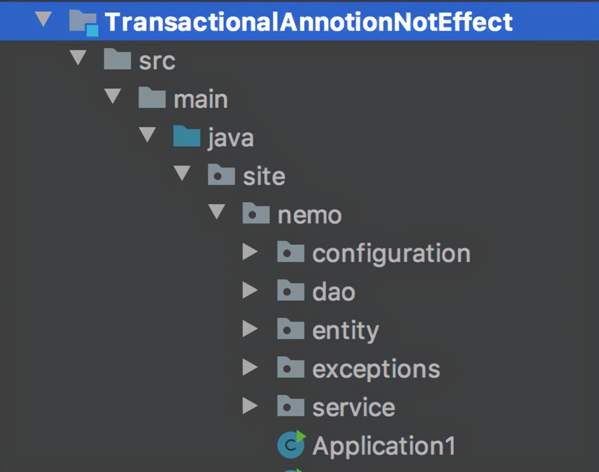
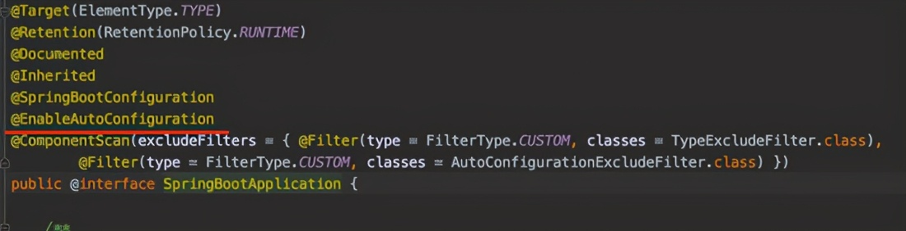
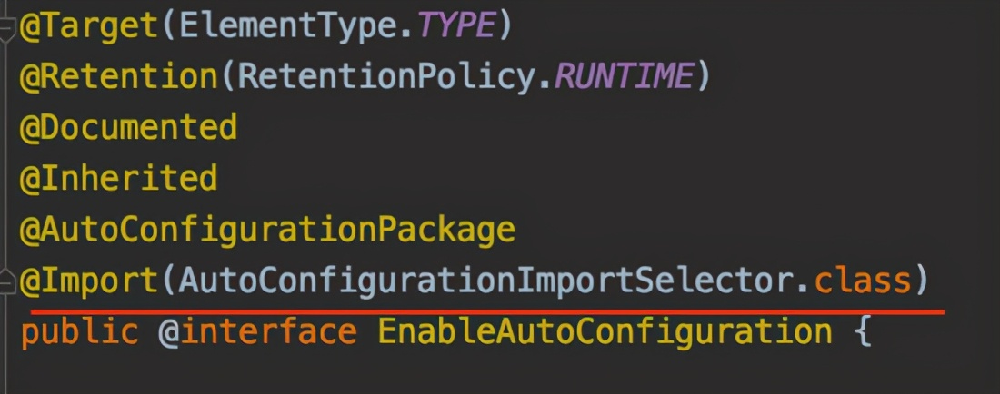
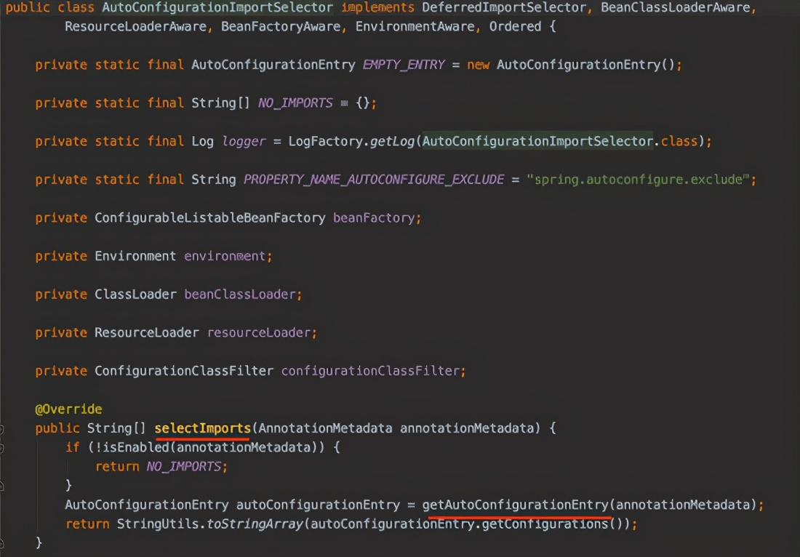
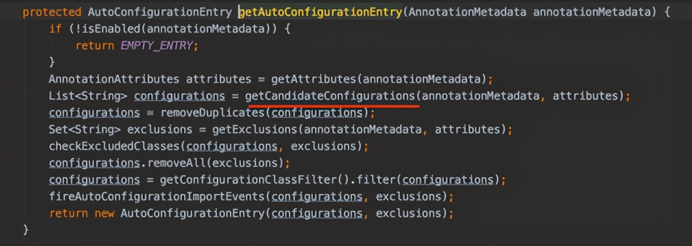
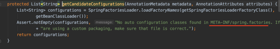
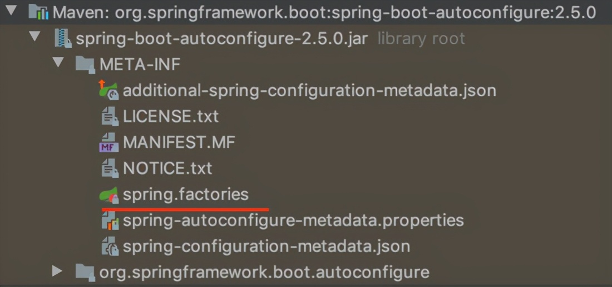
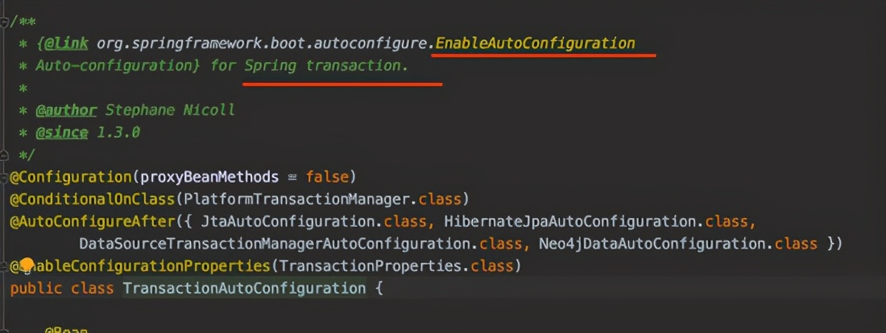
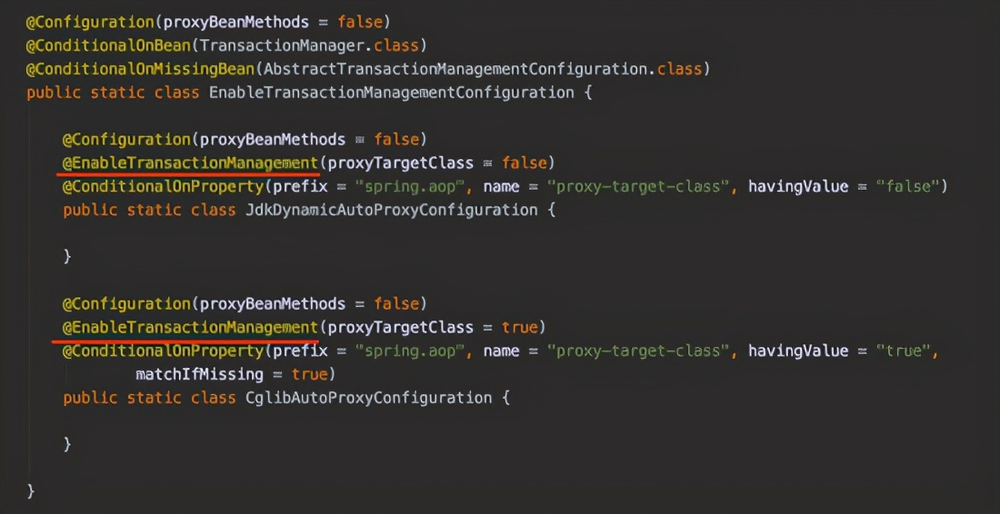
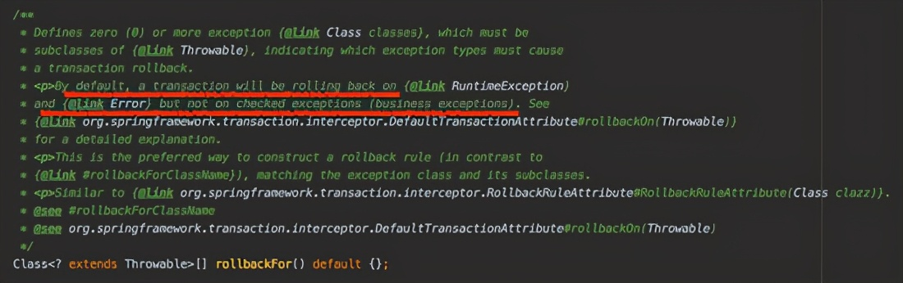

# @Transactional在什么情况下事务不生效？

原文：https://www.toutiao.com/i6970214190397145604/


## 1. 测试的前期准备

​        @Transactional注解标注的方法在什么情况下事务不会生效？我们可以写一个demo项目，引入以下依赖：

```xml
    <dependencies>
        <dependency>
            <groupId>mysql</groupId>
            <artifactId>mysql-connector-java</artifactId>
            <version>5.1.6</version>
        </dependency>
        <dependency>
            <groupId>org.springframework</groupId>
            <artifactId>spring-jdbc</artifactId>
            <version>5.2.8.RELEASE</version>
        </dependency>
        <dependency>
            <groupId>org.springframework</groupId>
            <artifactId>spring-context</artifactId>
            <version>5.2.8.RELEASE</version>
        </dependency>
    </dependencies>
```

​        项目的目录结构如下：



新建一个user表，之后会用上：

```sql
CREATE TABLE `tb_user` (
  `id` int(10) unsigned NOT NULL AUTO_INCREMENT,
  `name` varchar(255) NOT NULL DEFAULT '',
  `age` int(11) NOT NULL DEFAULT '0',
  PRIMARY KEY (`id`)
) ENGINE=InnoDB AUTO_INCREMENT=50 DEFAULT CHARSET=utf8
```

然后需要在 site.nemo.entity 包里面定义一个User类：

```java
package site.nemo.entity;

public class User {

    private Integer id;
    private String name;
    private Integer age;

    public Integer getId() {
        return id;
    }

    public void setId(Integer id) {
        this.id = id;
    }

    public String getName() {
        return name;
    }

    public void setName(String name) {
        this.name = name;
    }

    public Integer getAge() {
        return age;
    }

    public void setAge(Integer age) {
        this.age = age;
    }

    @Override
    public String toString() {
        return "User{" +
                "id=" + id +
                ", name='" + name + '\'' +
                ", age=" + age +
                '}';
    }
}
```

然后还需要一个Dao，来操作user表。在 site.nemo.dao 包下新建一个UserDao类：

```java
@Repository
public class UserDao {

    @Autowired
    private JdbcTemplate jdbcTemplate;

    public void save(User user) {
        jdbcTemplate.update("insert into tb_user (name, age) values (?, ?)", user.getName(), user.getAge());
    }
}
```

然后还需要对jdbc的数据源进行一些配置，在 site.nemo.configuration 包里面新建一个配置类:

```java
@Configuration
@ComponentScan(basePackages = {"site.nemo.service", "site.nemo.dao"})
public class TransactionConfiguration {

    @Bean
    public JdbcTemplate jdbcTemplate() {
        return new JdbcTemplate(dataSource());
    }

    @Bean
    public DataSource dataSource() {

        DriverManagerDataSource dataSource = new DriverManagerDataSource();
        dataSource.setDriverClassName("com.mysql.jdbc.Driver");
        dataSource.setUrl("jdbc:mysql://xxx.xxx.xxx.xxx:3306/mytestdb?characterEncoding=utf8");
        dataSource.setUsername("xxxx");
        dataSource.setPassword("xxxx");

        return dataSource;
    }
}
```

最后在 site.nemo.service 里面新建一个UserService：

```java
@Service
public class UserService {

    @Autowired
    private UserDao userDao;

}
```

下面开始分析几个@Transactional没有起作用的原因。


## 2. @Transactional不起作用的几种情况

### 2.1 没有开启事务管理

​        给 UserService 添加一个方法，如下所示：

```java
    @Transactional
    public void save1() {
        User user = new User();
        user.setName("1");
        user.setAge(1);

        userDao.save(user);

        int i = 1 / 0;
    }
```

​        该方法是往tb_user表里面插入一条数据，在方法的最后有一个 1/0 ，肯定会报错。这个方法执行结果的预期是：在该方法上标注了 @Transactional 注解，当它里面有异常的时候，能够事务回滚。也就是希望数据没有被插入数据库。

​        现在在 site.nemo 包下新建一个类 Application1 ，来调用 UserService 的 save1 方法：

```java
public class Application1 {

    public static void main(String[] args) {
        ApplicationContext context = new AnnotationConfigApplicationContext(
            TransactionConfiguration.class);
        UserService userService = context.getBean(UserService.class);
        userService.save1();
    }
}
```

​        运行 Application1 的main方法，可以看到控制台打印出了错误堆栈。

​        但是， 1 这个用户还是被插入到数据库了。并没有事务回滚。

​        原因是，代码中并没有添加 ***@EnableTransactionManagement* 来开启事务管理**，所以 @Transactional 没生效。

​        当在 ***TransactionConfiguration*** 这个类上面加上 ***@EnableTransactionManagement*** 注解之后，再执行 Application1 的 main() 方法，可以看到数据没有插入即事务被回滚了。

​        如果使用的是**springboot框架，它会自动开启了事务管理**。可以从框架源码里面看一下springboot框架的启动类都会加上 @SpringBootApplication 注解，而 @SpringBootApplication注解其实是 @EnableAutoConfiguration 注解和其他注解的组合：





​        而 @EnableAutoConfiguration 注解使用了@Import来引入 **AutoConfigurationImportSelector.class** 选择器。查看 
AutoConfigurationImportSelector.class 的源码，在 selectImports 方法中找到了 *getAutoConfigurationEntry* 方法的调用：



​        进入 getAutoConfigurationEntry 方法看一下，它调用了 **getCandidateConfigurations** 方法：



​        进入 getCandidateConfigurations 方法，可以看到它会去读**spring.factories**文件：



​        可以知道 **getCandidateConfigurations 方法会去读 spring.factories 文件**，可以从项目的 Externnal Libraries 里面找到 org.springframework.boot:spring-boot-autoconfigure ，找到它的 META-INF文件夹，可以看到里面有 spring.factories 文件：



​        点开 spring.factories 文件，搜索一下与transaction有关的：



​        看一下 TransactionAutoConfiguration 类里面的具体内容，看到了熟悉的 @EnableTransactionManagement 注解：



​        除了上面说的在普通的非springboot项目里面没有开启了事务管理 @EnableTransactionManagement 这个原因导致@Transactional没有生效，下面也会分析以下其他原因。

​        下面分析的几个case，都是在已经开启了事务管理 @EnableTransactionManagement 的基础上。

### 2.2 标注了@Transactional的方法里的异常被捕获了

​        给 UserService 再添加一个 save2 方法，如下所示：

```java
    @Transactional
    public void save2() {
    	try {
          User user = new User();
        	user.setName("2");
        	user.setAge(2);

        	userDao.save(user);

        	int i = 1 / 0;
        } catch (Exception e) {
            e.printStackTrace();
        }
    }
```

​        现在在 site.nemo 包下新建一个类 Application2 ，来调用 UserService的 save2 方法：

```java
public class Application2 {

    public static void main(String[] args) {
        ApplicationContext context = new AnnotationConfigApplicationContext(
            TransactionConfiguration.class);
        UserService userService = context.getBean(UserService.class);
        userService.save2();
    }
}
```

​        从结果可知，事务没有回滚。

​        因为save2方法使用了try/catch捕获了异常，所以即使标注了@Transactional，这个方法也还是没回滚。

​        可以点进去@Transactional看下它的具体内容，可以看到它有一个 rollbackFor 属性。看下它的注释：



​        注释里面提到，***默认情况下，当发生 Error 或者 RuntimeException 的时候，才会回滚***。

​        而save2方法上面标注的@Transactional并没有指定 rollbackFor 属性，而且save2里面的异常被我们捕获了且没有再抛出来，所以save2没有回滚。

### 2.3 标注了@Transactional的方法发生了非 Error 或者 RuntimeException

​        从第二个原因里面可以知道，默认情况下，当发生 Error 或者 RuntimeException 的时候，才会回滚。

​        所以来试一下当抛出的不是这两个异常的时候，会不会回滚。可以自定义一个 BusinessException ，它继承的是Exception：

```java
package site.nemo.exceptions;

public class BusinessException extends Exception {

    public BusinessException() {
        super();
    }

    public BusinessException(String msg) {
        super(msg);
    }
}
```

​        然后在 UserService 里面再添加一个方法 save3

```java
    @Transactional
    public void save3() throws BusinessException {
        User user = new User();
        user.setName("3");
        user.setAge(3);

        userDao.save(user);

        throw new BusinessException("test save3");
    }
```

​        现在在 site.nemo 包下新建一个类 Application3 ，来调用 UserService的 save3 方法

```java
public class Application3 {

    public static void main(String[] args) {
        ApplicationContext context = new AnnotationConfigApplicationContext(
        TransactionConfiguration.class);
        UserService userService = context.getBean(UserService.class);
        try {
            userService.save3();
        } catch (Exception e) {
            e.printStackTrace();
        }
    }
}
```

​        从结果可知，事务没有回滚。

### 2.4 标注了@Transactional的方法的事务传播类型propagation配置成了NOTSUPPORT

​        ***NOTSUPPORT*** 表示不支持事务，即使当前有事务，也不会使用事务。

​        所以当 propagation = Propagation.NOT_SUPPORTED 的时候，不会使用事务。所以异常发生的时候，也就不会回滚。可以试验一下， 在 UserService 里面添加 save4 方法，在它上面声明@Transactional注解，并且设置 propagation = Propagation.NOT_SUPPORTED：

```java
    @Transactional(propagation = Propagation.NOT_SUPPORTED)
    public void save4() {
        User user = new User();
        user.setName("4");
        user.setAge(4);

        userDao.save(user);

        int i = 1 / 0;
    }
```

​        现在在 site.nemo 包下新建一个类 Application4 ，来调用 UserService的 save4 方法：

```java
public class Application4 {

    public static void main(String[] args) {
        ApplicationContext context = new AnnotationConfigApplicationContext(
        TransactionConfiguration.class);
        UserService userService = context.getBean(UserService.class);
        userService.save4();
    }
}
```

​        从结果可知，没有回滚。

### 2.5 标注了@Transactional的方法的事务传播类型propagation配置成了NEVER

​        ***NEVER*** 表示不支持事务，如果有事务则会报错

​        可以试验一下， 在 UserService 里面添加 save5 方法，在它上面声明@Transactional注解，并且设置 propagation = Propagation.NEVER：

```java
    @Transactional(propagation = Propagation.NEVER)
    public void save5() {
        User user = new User();
        user.setName("5");
        user.setAge(5);

        userDao.save(user);

        int i = 1 / 0;
    }
```

​        现在在 site.nemo 包下新建一个类 Application5 ，来调用 UserService的 save5 方法：

```java
public class Application5 {

    public static void main(String[] args) {
        ApplicationContext context = new AnnotationConfigApplicationContext(
        TransactionConfiguration.class);
        UserService userService = context.getBean(UserService.class);
        userService.save5();
    }
}
```

​        从结果可知，没有回滚。

### 2.6 标注了@Transactional的方法的事务传播类型propagation配置成了SUPPORTS且当前没有事务

​        ***SUPPORTS*** 的意思是，如果当前有事务，就加入，***如果没事务，则以非事务运行。***

​        可以试验一下， 在 UserService 里面添加 save6 方法，在它上面声明@Transactional注解，并且设置 propagation = Propagation.SUPPORTS：

```java
    @Transactional(propagation = Propagation.SUPPORTS)
    public void save6() {
        User user = new User();
        user.setName("6");
        user.setAge(6);

        userDao.save(user);

        int i = 1 / 0;
    }
```

​        现在在 site.nemo 包下新建一个类 Application6 ，来调用 UserService的 save6 方法：

```java
public class Application6 {

    public static void main(String[] args) {
        ApplicationContext context = new AnnotationConfigApplicationContext(
        TransactionConfiguration.class);
        UserService userService = context.getBean(UserService.class);
        userService.save6();
    }
}
```

​        从结果可知，没有回滚。

### 2.7 外部调用方法A，A内部调用方法B，A没有@Transaction注解而B有@Transactional注解

​        在 UserService 里面添加 save7 方法，和 save72 方法，其中 save72 上面标有@Transactional注解，且save72里面有异常：

```java
    public void save7() {
        User user = new User();
        user.setName("7");
        user.setAge(7);

        userDao.save(user);
        save72();
    }

    @Transactional
    public void save72() {
        User user = new User();
        user.setName("72");
        user.setAge(72);

        userDao.save(user);

        int i = 1 / 0;
    }
```

​        现在在 site.nemo 包下新建一个类 Application7 ，来调用 UserService的 save7 方法

```java
public class Application7 {

    public static void main(String[] args) {
        ApplicationContext context = new AnnotationConfigApplicationContext(
        TransactionConfiguration.class);
        UserService userService = context.getBean(UserService.class);
        userService.save7();
    }
}
```

​        从结果可以看出，save72方法没有回滚。

​        这是因为， save7 方法没有标注@Transactional注解，它内部调用 save72()其实可以看做是 this.save72() ，**这里的this其实是个普通对象，没有被AOP动态代理增强过**。所以 save72()出现异常的时候没有回滚。

​        那么其实我们也可以知道，如果save7和sav72上面都有@Transactional注解的话，事务最终会回滚，并不是因为save72上面的注解生效了，而是因为save7上面的注解生效了，save72回滚只不过是因为被包在了save7的事务里面，是在整个大事务里面回滚的。

### 2.8 标注了@Transactional的方法A的propagation配置成了REQUIRE，标注了@Transactional的方法B的propagation配置成了REQUIRE_NEW，方法A调用了方法B

​        REQUIRE表示如果当前有事务，则加入事务；如果当前没事务，则新起一个事务；REQUEIRE_NEW表示不管当前是否有事务，都新起一个事务。

​        标注了@Transactional的方法A的propagation配置成了REQUIRE，标注了@Transactional的方法B的propagation配置成了REQUIRE_NEW，方法A调用了方法B。那么当A最后因为异常回滚的时候，B不会回滚。

​        实验一下，可以新建一个 UserService2 ，里面有一个 save8() ，它的事务传播类型是 REQUIRED 。 UserService2 有一个属性是 UserService 的实例。在 UserService2#save8() 里面会调用 UserService#save82() 方法：

```java
@Service
public class UserService2 {

    @Autowired
    private UserDao userDao;

    @Autowired
    private UserService userService;


    @Transactional(propagation = Propagation.REQUIRED)
    public void save8() {
        User user = new User();
        user.setName("service2-8");
        user.setAge(8);
        userDao.save(user);

        userService.save82();

        int i = 1/0;
    }
}
```

​        在 UserService 里面添加方法 save82() ，它的事务传播类型是 REQUIRES_NEW：

```java
    @Transactional(propagation = Propagation.REQUIRES_NEW)
    public void save82() {
        User user = new User();
        user.setName("82");
        user.setAge(82);

        userDao.save(user);

        int i = 1 / 0;
    }
```

​        现在在 site.nemo 包下新建一个类 Application8 ，来调用 UserService的 save8 方法：

```java
public class Application8 {

    public static void main(String[] args) {
        ApplicationContext context = new AnnotationConfigApplicationContext(
        TransactionConfiguration.class);
        UserService2 userService2 = context.getBean(UserService2.class);
        userService2.save8();

    }
}
```

​        从结果可以看出，save8回滚了，但是save82没有回滚。因为save82的事务传播类型是REQUIRES_NEW，它会新起一个事务，与原来的事务没关系。

### 2.9 标注了@Transactional的方法不是public的

​        可以在 UserService 里面新增一个protect方法 save9：

```java
    @Transactional
    protected void save9() {
        User user = new User();
        user.setName("9");
        user.setAge(9);

        userDao.save(user);


        int i = 1 / 0;
    }
```

​        由于protect方法只能包内调用，可以在 site.nemo.service 里面加入一个 UserServiceManager 类，该类调用了 UserService 的protect方法：

```java
package site.nemo.service;

import org.springframework.beans.factory.annotation.Autowired;
import org.springframework.stereotype.Component;

@Component
public class UserManager {

    @Autowired
    private UserService userService;

    public void testUserService9() {
        userService.save9();
    }
}
```

​        现在在 site.nemo 包下新建一个类 Application9

```java
public class Application9 {

    public static void main(String[] args) {
        ApplicationContext context = new AnnotationConfigApplicationContext(
        TransactionConfiguration.class);
        UserManager userManager = context.getBean(UserManager.class);
        userManager.testUserService9();
    }
}
```

​        从结果可以看出，没有回滚。

### 2.10 标注了@Transactional的方法发生的异常不是rollbackFor指定的类型或子类

​        可以在 UserService 里面新增一个方法 save10 ，它的@Transactional里指定rollbackFor为BusinessException，即发生BusinessException或它子类异常的时候才会回滚。但是在 save10 里面抛出的是Exception类型的异常：

```java
    @Transactional(rollbackFor = BusinessException.class)
    public void save10() throws Exception {
        User user = new User();
        user.setName("10");
        user.setAge(10);

        userDao.save(user);

        throw new Exception("test save10");
    }
```

​        现在在 site.nemo 包下新建一个类 Application10：

```java
public class Application10 {

    public static void main(String[] args) {
        ApplicationContext context = new AnnotationConfigApplicationContext(
        TransactionConfiguration.class);
        UserService userService = context.getBean(UserService.class);
        userService.save10();
    }
}
```

​        从结果可以看出，没有回滚。

### 2.11 数据库不支持事物

​        如果数据库引擎不支持事务的话，随便怎么加@Transactional，都不会生效。

