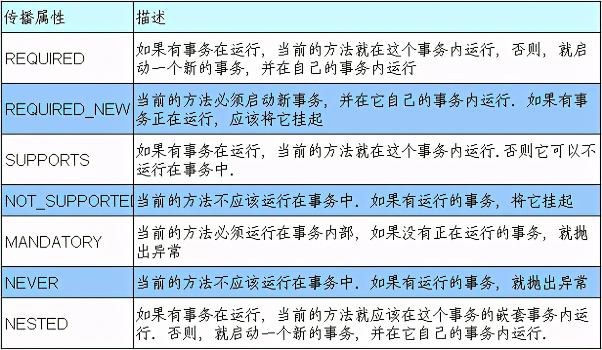
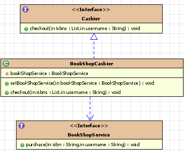
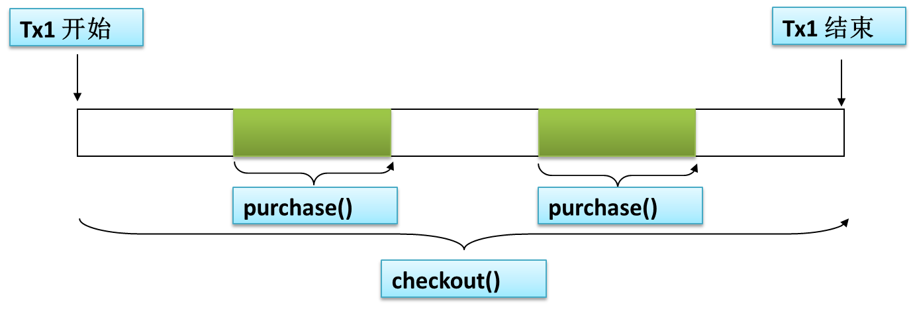
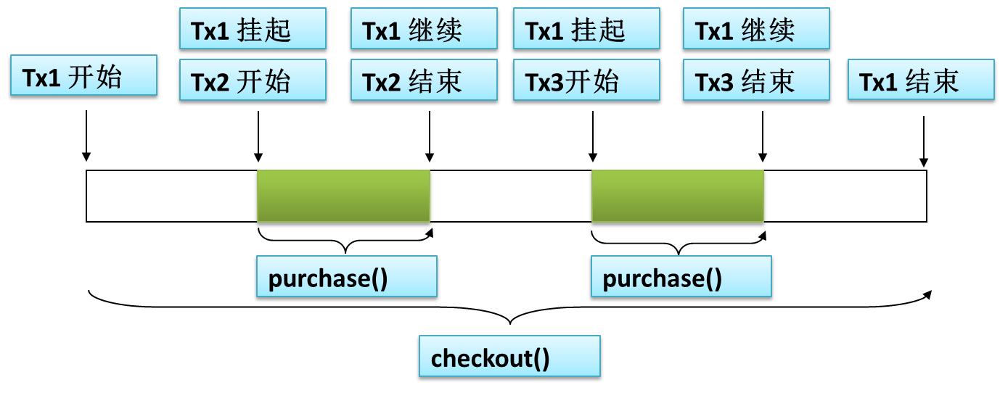

# Spring的事务传播行为

原文：https://www.toutiao.com/i6979031780774937091/?group_id=6979031780774937091


## 1. Spring启动数据库事务

### 1.1 配置文件

```xml
<!-- 配置事务 -->
<bean id="transactionManager" class="org.springframework.jdbc.datasource.DataSourceTransactionManager">
    <property name="dataSource" ref="dataSource"></property>
</bean>

<!– 启用事务注解 –>
<tx:annotation-driven transaction-manager=“transactionManager”/>
```

### 1.2 通过注解添加事务

```java
@Transactional(rollbackForClassName = { "Exception", "RuntimeException" })
public void save(PersonEntity entity) {
    personDao.save(entity);
}
```

## 2. 事务的传播行为

### 2.1 介绍

当一个事务被另一个事务方法调用时，必须指定事务应该如何传播。例如：方法可能继续在现有事务中运行，也可能开启一个新事务，并在自己的事务中运行。

事务的传播行为由传播属性指定。Spring 定义了 7 种传播行为：



事务传播属性可以在 @Transactional 注解的 propagation 属性中定义。

### 2.2 测试



说明：

#### 2.2.1 REQUIRED 行为

当 bookService 的 purchase() 方法被另一个事务方法 checkout() 调用时，它默认会在现有的事务内运行。这个默认的传播行为就是 REQUIRED。因此，在 checkout() 方法的开始和终止边界只有一个事务。这个事务，只在 checkout() 方法结束的时候提交，结果用户一本书都买不了。



#### 2.2.2 REQUIRES_NEW 行为

表示该方法必须启动一个新事务，并在自己的事务内运行。如果有事务在运行，就应该先挂起它。



### 2.3 补充说明

在Spring 2.x事务通知中，可以想像下面在<tx:method> 元素中设定传播事务属性。

